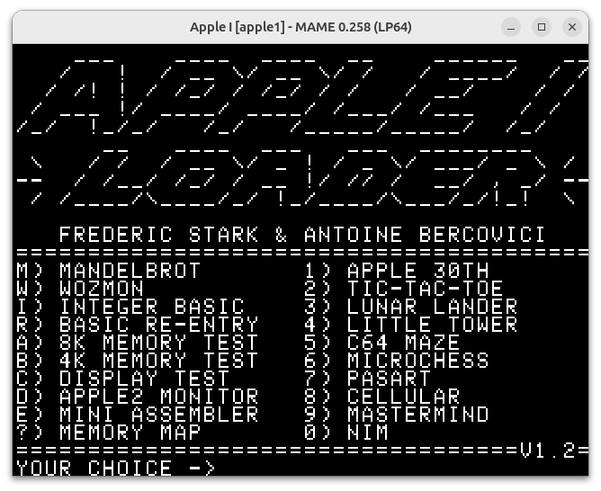

# Loader for the Apple1

This is the loader for aberco/SiliconInsider 32K ROM for the Apple1

It contains an assortment of software for the Apple1, to test and demo the machine.

The rom file is [silicrom.rom](silicrom.rom).

You can build the ROM using the top-level Makefile, if you have the right tools installed (xa assembler, ca65 tool suite, python3).

A snapshot named 'a.snp' will be placed next to the rom. It can be loaded in mame using: ``~/Development/mame/mame -debug apple1 -ui_active -resolution 640x480 -snapshot a.snp``

# Content of the ROM

When booting you Apple1 (if you mapped the $F000-$FFFF region), or after executing ``5000R``, you will be greated by this menu (after having cleared the screen and pressed reset):

You don't have to wait for the menu to display: you can type the key corresponding to the program you want to execute during the display.

You can always return to the menu, but pressing the Reset key (and entering ``5000R`` if needed).

## Mandelbrot

This is a fast mandelbrot explorer, written specifically for this ROM.

Source available at: https://github.com/fstark/mandelbrot65/

It will display a short introduction message, and display the Mandelbrot set.

I will then wait for 5 seconds, and zoom in a random-but-interesting place. It will then zoom into the zoom, up to 5 levels of zooms.

You can skip a display by pressing ``space``. You can return the the top-level Mandelbrot set by pressing ``space`` twice in succession.

## WozMon

``W`` gives you access to Wozmom. This is useful if you chose to map the $f000-$ffff space, as the Apple1 would now boot the loader instead of the Wozniak monitor.

The fundamental commands to remember are:

* ``adrs1.adrs2`` to display the memory between ``adrs1`` and ``adrs2``
* ``adrsR`` to **R**un at address ``adrs``
* ``adrs:value1 value2 value3...`` to store ``value1``, ``value2``, ``value3`` starting at ``adrs``. Beware that the display shows the content of the previous value at ``adrs``. This can be confusing sometimes.

## Integer BASIC

``I`` is for *Integer BASIC, which is the original basic of the Apple1.

The BASIC is present in the ROM and should be mapped to $E000.

You can now create the standard ``10 PRINT``, ``20 GOTO 10`` demos!

This also served as the basis for the BASIC that shipped with the original Apple2. [Here is the original manual for the basic](https://ia801902.us.archive.org/11/items/apple1_basic_manual/apple1_basic_manual.pdf).

Note that Integer BASIC defaults to 4K of RAM. If you have 8K, you may want to use ``HIMEM=8192`` before typing in your program. However, as you can't have both the ROM card and a Cassette Interface Card, it is unlikely you will find use for that much memory.

## Re-entering BASIC

When you hit reset, you can re-enter the BASIC without losing the current program by using the ``R`` key.

The program we entered in BASIC is still present.

## Testing 8K of memory

Press ``A`` to execute a 8K memory test, on adresses from ``$0000`` to ``$1FFF``.

Each pass will take around 13 seconds.

## Testing 4K of memory

If you Apple1 only have 4K of memory, from ``$0000`` to ``$0fff``, press ``B`` for a memory test.

Each pass will take around 6 seconds.

## Testing the display

With ``C`` you can test the display of your Apple1.

This is useful to check that your Apple1 Character ROM is correct by comparing your display with the above screenshot.

## Using the Apple2 Monitor

``D`` will launch the Apple2 monitor, as you would on a Apple2, using ``CALL -151``.

This is useful, for instance, to disassemble memory.

## Using the Apple2 Mini-Assembler

``E`` will launch the Apple2 mini-assembler. It was included with the early Integer BASIC versions of the Apple2.

This version have been modified, so entering a '#' in the first column will launch Wozmon. In the above example a simple program that writes an infinite number of ``A`` on screen has been assembled at adress ``$0280``. Then ``#`` is used to launch Wozmon and ``280R`` executes our new assembled software.

## The Apple 30th Demo

``1`` will launch the famous Apple 30th Anniversary Demo.

## Playing Tic-Tac-Toe

``2`` will launch a classic from the late 70s, early 80s: a BASIC tic-tac-toe game, shown here in a somewhat precarious position.

This is a BASIC program. Pressing ``Reset`` and choosing to re-enter BASIC with the ``R`` option will let you admire the source code:

## Landing on the Moon

``3`` is for Lunar Lander, a huge classic back in the day.

This game needs no introduction or explanations. It is also harder than it looks...

## A small adventure

``4`` brings *Little Tower* a small text adventure game for the Apple 1. It is pretty rough on the edges, but you should be able to beat it in a few minutes.

The version included has been patched so one can actually get the key and finish the game...

## C64 Maze

Press ``5`` and you will cover the screen in little ``/`` and ``\``, re-creating the classic Commodore 64 BASIC one-liner.

## Micro-Chess

With ``6`` you get the extraordinary micro-chess, a chess program written originaly for the KIM-1

You can guess my nationality by looking at the above chessboard...

You move the pieces by specifying the from and to squares (13-33 for e2-e4, for instance), and you tell the computer to play by pressing the ``P`` key.

The documentation of [this versions seems to match the one on the apple1](http://retro.hansotten.nl/6502-sbc/lee-davison-web-site/microchess/). The [original microchess is available too](https://www.benlo.com/microchess/Kim-1Microchess.html), but won't explain the key bindings of the Apple1...

What an extraordinary feat from Peter R. Jennings to get a full chess program in 1 kilobyte of code!

## PASART

Pasart is ``7``. Not sure why it is called this way, but you can get some interesting patterns by tring various values.

Try other numbers, like ``18,35,9,1``, ``18,35,61,2`` or ``19,39,55,2``...

## Cellular

Cellular automaton always have been classic for display on old computers, and the Apple1 is no exception. Use ``8`` to run Cellular, a [1d cellular automaton](https://en.wikipedia.org/wiki/Elementary_cellular_automaton). Don't get fooled by the apparent simplicity, [some people believe they contain the secret of eveything](https://en.wikipedia.org/wiki/A_New_Kind_of_Science).

Above is the famous rule 30 automaton (1E in hex). [You can look up the rules from there](https://mathworld.wolfram.com/ElementaryCellularAutomaton.html), but will have to enter them in hexadecimal...

## Mastermind

Press ``9`` for the original implementation of Mastermind on the Apple1.  Mastermind was a popular board game in the 70s and early 80s.

You are trying to find the code, composed by numbers from 0 to 7. 

This is quite difficult, as the numbers can be repeated. You enter a potential solution, and you get a '+' for every number in the right position, and a '-' for every number in the wrong position.

## Nim

Finally, ``0`` will launch [a game of Nim](https://en.wikipedia.org/wiki/Nim), an ancien game, very popular on early computers, as it is easy to program and have an elegant mathematical way for the computer to play.

At the begining you choose how many heaps you want, and how many objects you want on each heap. Remember that you will play first.

At each turn, you have to choose a heap, and remove at least one object from it. The player that removes the last object from the last heap wins (this is the opposite of the way it is commonly played, but doesn't change the core game).

Have fun, but if you don't play absolutely perfectly, your Apple 1 will always win...